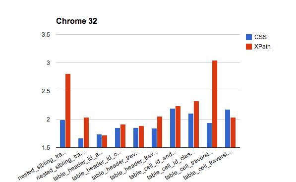
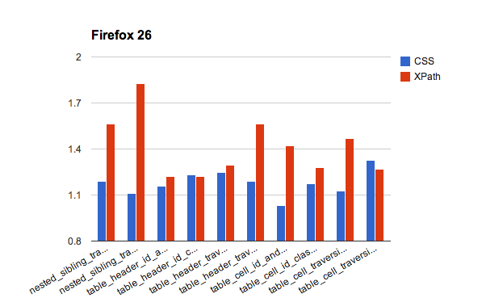
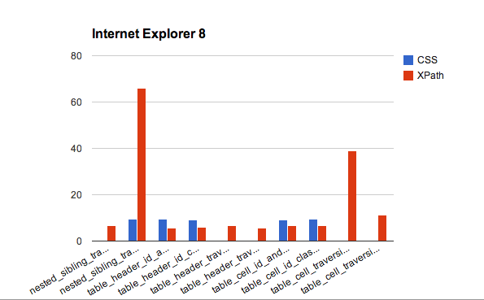
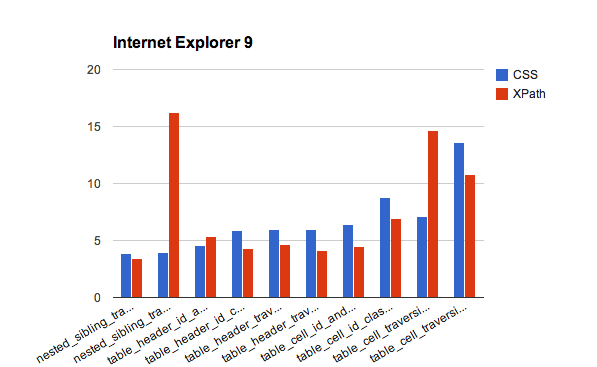
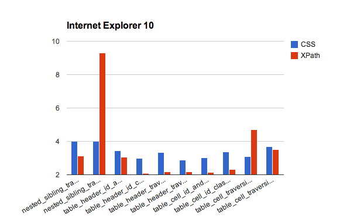
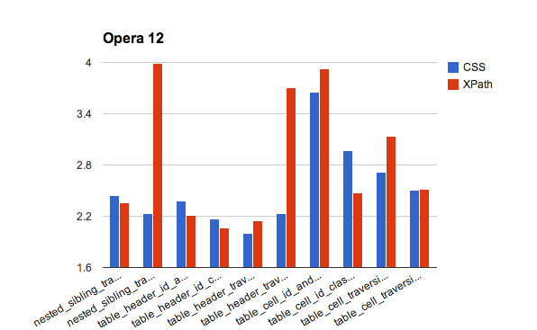

# CSS vs. XPath, Conclusion

>**NOTE: This is part 3 of 3. For the first installment, [go here](https://elementalselenium.com/docs/css-vs-xpath/32-css-vs-xpath). 
> For the second installment, go [here](https://elementalselenium.com/docs/css-vs-xpath-2/33-css-vs-xpath-2).**

## Intro

In [the last tip](https://elementalselenium.com/docs/css-vs-xpath-2/33-css-vs-xpath-2) I provided benchmarks that 
showed XPath and CSS performance across various browsers. Since then I've received feedback on some things that my 
test was missing -- most notably more browser coverage (e.g., Internet Explorer 9 and 10) and testing against a 
larger and deeper page.

## A Solution

In order to make sure these benchmarks are as thorough as possible I've put together 
[an example that demonstrates a large and deep page](http://the-internet.herokuapp.com/large), and retooled 
[my test script](https://github.com/diemol/selenium-benchmark/blob/master/lib/page-objects/large_dom.rb) accordingly. 
Otherwise, everything is pretty much the same as last time (e.g., dual runs to weed out anomalies, 100 test executions 
for time in seconds, etc.).

Let's dig into the results.

## The Results

### In Table Form

[]

### In Chart Form

## What The Results Tell Us

Chrome and Firefox are clearly tuned for faster CSS performance. Internet Explorer 8 is a grab bag of CSS that 
won't work, an out of control XPath traversal that takes ~65 seconds, and a 38 second table traversal with no CSS 
result to compare it against.

In IE 9 and 10, XPath is faster overall. In Safari, it's a toss up, except for a couple of slower traversal runs 
with XPath. And across almost all browsers, 
[the nested sibling traversal](https://github.com/diemol/selenium-benchmark/blob/master/lib/page-objects/large_dom.rb#L13)
and [table cell traversal](https://github.com/diemol/selenium-benchmark/blob/master/lib/page-objects/large_dom.rb#L41)
done with XPath are an expensive operation.

That shouldn't be too surprising though since they are brittle and inefficient ways to write locators. Do try to avoid them.

## Summary

So all in all there are two circumstances where XPath is markedly slower than CSS. But they are easily avoidable. 
Otherwise, the performance difference is slightly in favor of CSS for non-IE browsers and slightly in favor of 
XPath for IE browsers. Given that, I would recommend that you choose your locator strategy based on what works for 
you and your team. And really, it doesn't matter. If you can ensure that the primary elements on your page have 
unique IDs and Classes then that will always be faster than traversing across the DOM (regardless of which locator 
strategy you use).

If you want to do some benchmarking on your own, I wrapped up all the code I wrote into 
[this library](https://github.com/diemol/selenium-benchmark).

Happy Testing!

## About The Author

A huge thanks to [David Burns](https://twitter.com/AutomatedTester), [Brian Goad](https://twitter.com/bbbco), [Dima Kovalenko](https://twitter.com/dimacus), 
and [Simon Stewart](https://twitter.com/shs96c) who provided great feedback and insight into the test and example design.
