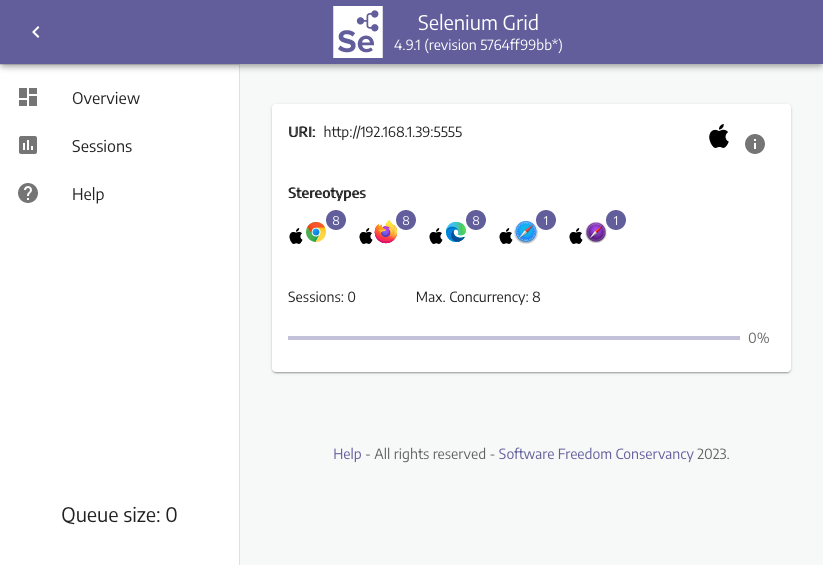

# How to Use Selenium Grid

## Intro

If you're looking to run your tests on different browser and operating system combinations but you're unable to justify using 
a third-party solution like [Sauce Labs](https://saucelabs.com/) or [BrowserStack](http://www.browserstack.com/) then what 
do you do?

## A Solution

With [Selenium Grid](https://www.selenium.dev/documentation/grid/) you can stand up a simple infrastructure of various browsers on different operating systems to not only distribute test load, but also give you a diversity of browsers to work with.

>A brief primer of Selenium Grid
>
>Selenium Grid is part of [the Selenium project](https://www.selenium.dev/). It lets you distribute test execution across several machines. You can connect to it with a remote WebDriver by specifying the browser, browser version, and operating system you want. You specify these values through Selenium `Capabilities`.
>
>There are two main elements to Selenium Grid -- a Hub, and Nodes. First you need to stand up a Hub. Then you can connect (or "register") Nodes to that Hub. 
>Nodes are where your tests will run, and the Hub is responsible for making sure your tests end up on the right one (e.g., the machine with the operating 
>system and browser you specified in your test).

Let's continue with an example.

## Example

### Part 1: Grid Setup

Selenium Grid comes built into the Selenium Standalone Server. So to get started we'll need to download the latest version of it from the Selenium 
[releases](https://github.com/SeleniumHQ/selenium/releases).

Then we need to start the Hub.

```sh
> java -jar selenium-server-<version>.jar hub 
...
16:49:29.816 INFO [Hub.execute] - Started Selenium Hub
...
```

After that we can register Nodes to it.

```sh
> java -jar selenium-server-<version>.jar node --hub http://localhost:4444
...
16:51:47.726 INFO [NodeServer.execute] - Started Selenium Node
...
```

__NOTE: This example only demonstrates a single node on the same machine as the hub. To span nodes across multiple machines you will need to place the standalone server on each machine and launch it with the same registration command (replacing `http://localhost` with the location of your hub, and specifying additional parameters as needed).__

Now that the grid is running we can view the available browsers by visiting our Grid's console at `http://localhost:4444/grid/console`.



To refine the list of available browsers, we can specify an additional `--driver-implementation` parameter when registering the Node. 
For instance, if we wanted to only offer Safari on a node, we could specify it with `--driver-implementation safari`, which would look 
like this:

```sh
java -jar selenium-server-<version>.jar node --hub http://localhost:4444 --driver-implementation safari
```

We could also repeat this parameter again if we wanted to explicitly specify more than one browser.

```sh
java -jar selenium-server-<version>.jar node --hub http://localhost:4444 --driver-implementation safari --driver-implementation chrome
```

There are numerous parameters that we can use at run time. You can see a full list at the 
[Selenium Grid documentation](https://www.selenium.dev/documentation/grid/configuration/cli_options/).

### Part 2: Test Setup

Now let's wire up a simple test script to use our new Grid.

```javascript
// filename: test/grid.spec.js
const assert = require("assert");
const { Builder, By } = require("selenium-webdriver");

describe("Grid", function() {
  let driver;

  beforeEach(async function() {
    const url = "http://localhost:4444";
    driver = await new Builder()
      .usingServer(url)
      .forBrowser("chrome")
      .build();
  });

  afterEach(async function() {
    await driver.quit();
  });

  it("hello world", async function() {
    await driver.get("http://the-internet.herokuapp.com/");
    assert((await driver.getTitle()) === "The Internet");
  });
});
```

Notice in `beforeEach` we're using a URL to connect to the Grid (e.g., `usingServer(url)`). And we are telling the Grid which 
browser we want to use by using the `forBrowser` method.

You can see a full list of the available browser options at the [Selenium documentation](https://www.selenium.dev/documentation/webdriver/browsers/).

## Expected Behavior

When we save this file and run it (e.g., `mocha` from the command-line) here is what will happen:

+ Connect to the Grid Hub
+ Hub determines which Node has the necessary browser/platform combination
+ Hub connects the test to the Node
+ Browser opens on the Node
+ Test runs
+ Browser closes on the Node

## Summary

If you're looking to set up Selenium Grid to work with Internet Explorer or Chrome, be sure to read up on how to set them up since there is 
additional configuration required for each. And if you run into issues, be sure to check out the browser driver documentation for the 
browser you're working with:

+ [ChromeDriver](https://chromedriver.chromium.org/)
+ [FirefoxDriver](https://firefox-source-docs.mozilla.org/testing/geckodriver/Support.html)
+ [SafariDriver](https://developer.apple.com/documentation/webkit/about_webdriver_for_safari)

Also, it's worth noting that while Selenium Grid is a great option for scaling your test infrastructure, it by itself will NOT give you 
parallelization. That is to say, it can handle as many connections as you throw at it (within reason), but you will still need to find a 
way to execute your tests in parallel.

Happy Testing!

## About The Author

Dave Haeffner is the original writer of Elemental Selenium -- a free, once weekly Selenium tip newsletter that's read by thousands of 
testing professionals. He also created and maintains the-internet (an open-source web app that's perfect for writing automated tests against).

Dave has helped numerous companies successfully implement automated acceptance testing; including The Motley Fool, ManTech International, 
Sittercity, and Animoto. He is also an active member of the Selenium project and has spoken at numerous conferences and meetups around 
the world about automated acceptance testing.

