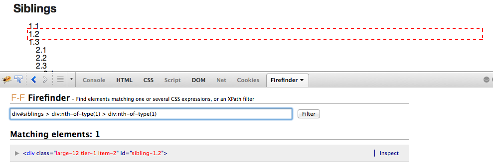
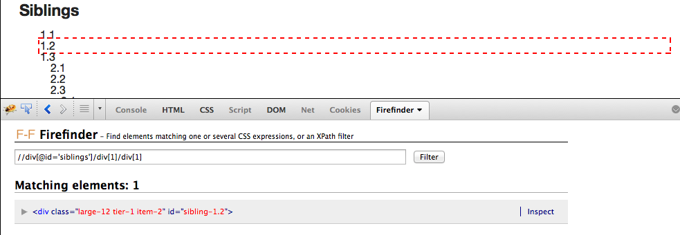
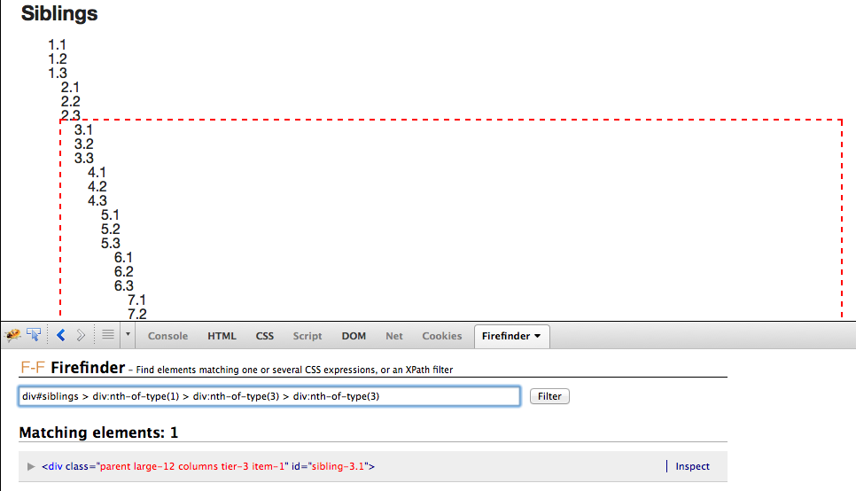
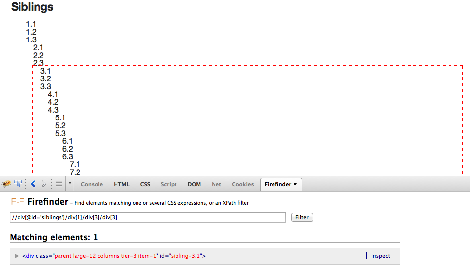

## The Problem

Locators are the lifeblood of your Selenium tests. If you're fortunate enough to be working with unique IDs and Classes, then you're usually all set.

But that's rarely the case. And when you have to traverse a page to interact with hard to reach elements, or you need to run down odd test behavior, it can be a real challenge to verify that you have the correct locators to accomplish what you want.

## A Solution

Instead of the painful and time consuming process of writing a test with locators, running it, and seeing what it does -- give [Firefinder](https://addons.mozilla.org/en-US/firefox/addon/firefinder-for-firebug/) a try. It is an add-on to the web-development Firefox plugin called [Firebug](https://addons.mozilla.org/en-US/firefox/addon/firebug/).

You first need to install Firebug, then Firefinder. Once done, verifying locators is a trivial task, and it works for both CSS and XPath locators.

## An Example

Let's try and find the locators necessary to traverse a few levels into a large set of nested divs.

```html
# a snippet from http://the-internet.herokuapp.com/large

<div id="siblings">
  <div id="sibling-1.1">
    1.1
    <div id="sibling-1.2">1.2</div>
    <div id="sibling-1.3">1.3</div>
    <div id="sibling-2.1">
      2.1
      <div id="sibling-2.2">2.2</div>
      <div id="sibling-2.2">2.3</div>
      <div id="sibling-3.1">
        3.1
        <div id="sibling-3.2">3.2</div>
        <div id="sibling-3.2">3.3</div>
        <div id="sibling-3.1">
          4.1
          <div id="sibling-3.2">4.2</div>
          <div id="sibling-3.2">4.3</div>
          ...
        </div>
      </div>
    </div>
  </div>
</div>
```

If we were to perform a `find_element` action using either of the following locators, they will work.

```ruby
# CSS
"div#siblings > div:nth-of-type(1) > div:nth-of-type(1)"

# XPath
"//div[@id='siblings']/div[1]/div[1]"
```

But if we try to go one level deeper, they won't work.

```ruby
# CSS
"div#siblings > div:nth-of-type(1) > div:nth-of-type(1) > div:nth-of-type(1)"

# XPath
"//div[@id='siblings']/div[1]/div[1]/div[1]"
```

Fortunately with Firefinder we can actually see what our locators are doing without leaving the browser. Here's what it shows us for the locators that _seemed_ to work.





Ah, our locators are scoping to the wrong part of the first level (1.2). What we need to do is reference the third part of each level (e.g., 1.3, 2.3, 3.3) in order to traverse deeper since the nested divs live _under_ the third part of each level.

So if we try these locators instead, they will work.

```ruby
# CSS
"div#siblings > div:nth-of-type(1) > div:nth-of-type(3) > div:nth-of-type(3)"

# XPath
"//div[@id='siblings']/div[1]/div[3]/div[3]"
```

And we can confirm this before writing _any_ test code by verifying these locators in Firefinder.





## Outro

Hopefully this tip will help save you time and frustration when running down tricky locators in your tests. It definitely has for me.

I'd like to give a big thanks to [Brian Goad](https://twitter.com/bbbco) for telling me about such a great tool. Alternatively, if you're comfortable with your browser development console then you can issue JavaScript commands to achieve a similar outcome (with no additional installation required).

Happy Testing!
