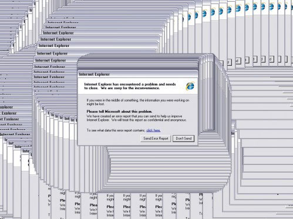

**NOTE: This is a guest post from Dima Kovalenko. He's a core committer to the Selenium project and [Selenium-Grid-Extras](https://github.com/groupon/Selenium-Grid-Extras). You can find him at [@dimacus on Twitter](https://twitter.com/dimacus) or on [the Selenium IRC chat channel](http://elementalselenium.com/tips/20-irc-chat) as `dimacus`. You can also check out [his testing blog](http://agilesoftwaretesting.com/) or [his book on Selenium](http://www.amazon.com/Selenium-Design-Patterns-Best-Practices-ebook/dp/B00NVDAWXI/).**

## The Problem

When I first encountered Selenium Grid, I was extremely happy and impressed by the possibilities. The idea of testing multiple browsers and computers at the same time is great! By using the Grid, we were able to collect all of the obsolete computers that were collecting dust in IT closets and make them do some work.

Shortly after setting up the first Grid at work, we started to see some odd behaviors. Windows computers would start running extremely slow, doubling and tripling the execution time.

From time to time Internet Explorer would crash and not close properly, which would lead to all subsequent Internet Explorer to not close after the test is complete; after 20 or 30 test runs, the computer would have dozens of Internet Explorer instances open. This lead to an all familiar crashing sight.

At this point the computer would become unresponsive, and all subsequent tests running on the node would crash with strange errors. Dozens of similar errors occurred during the execution of a test suite on Windows, Linux, and OSX nodes. After a while I had to give up and run our tests without the Grid.

## A Solution

A couple of years after that Selenium Grid 2.0 came out. It had many of the previous issues fixed. However, the fixes only applied to stabilizing _the web browser_, some of the OS level problems still persisted. But the advantages of Grid 2.0 outweighed the short falls, so we decided to invest some time in setting up the Grid once more.

This time around I decided to supplement the Selenium Grid with some helper scripts, giving birth to [the Selenium Grid Extras project](https://github.com/groupon/Selenium-Grid-Extras).

## A Selenium Grid Extras Primer

The idea behind the project was to fix some of the issues that come up outside of the web browser. Cleaning up the node before and after each test at the Operating System level has improved the stability of our testing dramatically.

Lets take a look at some of the clean up tasks that Selenium Grid Extras performs to give stability to the Grid Node.

### Explicitly kill web browser after each test

After a test run is complete, Selenium Grid Extras tries to kill any remaining or crashed instances of the browser used. Unlike the kill command that comes from within WebDriver, this kill command is an OS level one, which is a `taskkill firefox` (or `kill -9 firefox`) equivalent. This guarantees that the node is still in a good working condition before each test starts.

### Modify settings for Internet Explorer

There are multiple settings that need to be tweaked to allow IE tests to run properly. These include setting the Protected Mode and Mixed Content Modes on and off. When Selenium Grid Extras is launched, it modifies all of these settings for a hassle free test execution.

### Periodically restart Grid Nodes

No matter how well an application is written, it will have some memory leaks and issues. We found that restarting the Java process from time to time is the fastest and most reliable to "clear the air". So when the Grid Node is not in use Selenium Grid Extras restarts the Java process to clear up the JVM of any remaining memory leaks that can cause instability.

### Restart the OS after several test runs

To add one more level of clean up, we restart the whole Operating System after certain amount of test runs. This helps to clear up any remaining items that might have crashed in the Operating System. Restarting the whole machine every 10 to 20 test runs is a huge boost in stability.

## Put Into Practice

Because of these clean up measures, we were able to run close to **180,000 test sessions** on a Grid of 15 machines in one month, with only **2% failure rate** due to node instability.

**NOTE: A single session can execute more than a single test. A failure due to instability applies to the browser not opening up or some other unrelated crash on the Operating System. This does not include failures of tests because the website itself was broken or due to test flakiness.**

## Another Advantage

Stability isn't the only advantage of using Selenium Grid Extras; one of the most exciting features is the ability to _automatically record the video of the running test session_.

The video recording happens at the OS level and **records not only the browser but also some information about the current node** (shown in the bottom left corner). Recording at the OS level allows us to review a test failure more effectively.

Sometimes a test fails without an obvious reason, but after reviewing the video we will discover that a system update or a pop-up blocker is to blame for the test failure.

## Outro

I hope that using [Selenium Grid Extras](https://github.com/groupon/Selenium-Grid-Extras) will assist you at your job and save you some of the confusion you might run in from time to time when using Selenium Grid.

Happy Testing!
