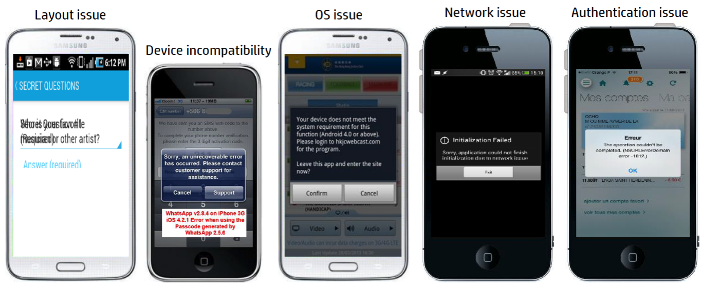
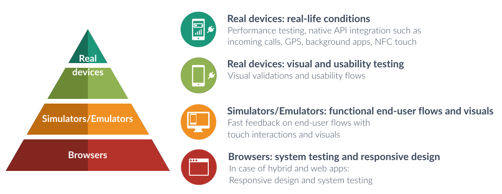

**NOTE: This is a guest post from Kwo Ding. You can follow him on Twitter [here](https://twitter.com/@dingkwo) and LinkedIn [here](https://www.linkedin.com/in/kwoding/). You can also see a recording of him delivering this material at SauceCon ([link](https://www.youtube.com/watch?v=ACP6N1L62AU)).**

## Introduction

Mobile testing involves more complexity when you compare it to web UI testing. A few examples of mobile testing challenges:

As you can see, mobile testing not only has to cover the UI aspects, but also the compatibility of hardware, network connectivity, operation system flavors (especially on Android), etc.

When most people start with testing for mobile, they tend to start with getting a few real devices and perform exploratory testing manually. Over time, the number of devices will grow, because actual customer feedback comes in describing that their app does not work properly in certain situations on specific devices. Does this sound familiar?

In order to reach fast feedback and lower amounts of the manual testing, a better usage of available tools is necessary.

## Mobile Test Pyramid

Based on my personal mobile testing experience, I came up with the mobile pyramid strategy. Of course, it was inspired by the test pyramid of Mike Cohn ('Succeeding with Agile', 2009). But this doesn't quite cover the detail that is needed for a good mobile testing strategy.

The mobile test pyramid has 3 levels:

- Real devices
- Mobile simulators & emulators
- Desktop browsers (using mobile simulation)

Identical to the generic test pyramid, the broader the layer in the pyramid, the more tests you should have which cover a wider range of complexity.

Here are the focus areas for each layer, along with their pros and cons as I see them.

### Desktop browsers: mobile testing on desktop browsers

| Focus area                | Description                                                                |
| ------------------------- | -------------------------------------------------------------------------- |
| Functional system testing | Isolated browser tests performing full functional validations              |
| Responsive design         | Resizing browsers and toggling user agents                                 |
| Cross-browser             | Use equivalent desktop browsers                                            |
| Overall visual layout     | No extensive visual checks because the rendering is different than devices |

#### Pros

- Fast execution: Matter of milliseconds to launch a browser, also headless execution is possible.
- Scalable: Easily set up 10+ browser instances per machine.
- Cross platform: Ability to use browsers on different operating systems.

#### Cons

- Mobile simulation uses the desktop browser engine: Mobile simulation in desktop browsers is still using the desktop browser.
- No native integration: No native keyboards, incoming calls, etc.
- Just not a device... Incredibly fast, but still not a real device.

### Mobile simulators/emulators: closer to the actual mobile experience...

**NOTE: Only applicable for iOS and Android.**

| Focus area                | Description                                                                                                     |
| ------------------------- | --------------------------------------------------------------------------------------------------------------- |
| Functional end-user flows | Click paths throughout the application                                                                          |
| Native API integration    | GPS injection, file attachments, incoming calls etc.                                                            |
| Visuals (vanilla only)    | Use equivalent desktop browsers                                                                                 |
| Overall visual layout     | Emulators are limited to vanilla versions                                                                       |
| Touch interactions        | Touch interactions such as swipe and tap comes closer to the user experience of a device than browser emulation |

#### Pros

- Easy to set up: Simulators/emulators are easy to set up, just download, install, and run.
- Scalable: Virtualization means scalable and also running in parallel on one machine.
- Native API integration: Ability to test native APIs such as incoming calls and GPS injection.
- Simulators or Intel-based emulators are fast: Simulators are fast, because they only have to simulate the software part. Emulators based on the Intel architecture are fast.
- Debugging possibilities: Easy to debug simulator/emulators, already hooked up to the machine to access logs.

#### Cons

- Vanilla versions only: Manufacturer’s skins are available, but the device behavior is still based on what comes stock.
- No real resource usage: CPU/memory usage of machine in case of simulators. Emulators try to simulate the hardware.
- No real interoperability: Connectivity with NFC, Bluetooth, network connections.
- Slow ARM-based emulators: Emulators based on the ARM architecture are slow, which is the main architecture for Android devices.
- Inaccurate color display in light/dark: Contrast/brightness inaccurate in light/dark environment.

### Real devices: the real thing...

| Focus area             | Description                                                                                        |
| ---------------------- | -------------------------------------------------------------------------------------------------- |
| Usability              | Validating usability such as actual click areas, touch actions and voice over                      |
| Performance            | CPU/memory usage, battery, network strengths                                                       |
| Native API integration | Interruption (incoming calls, push notifications), resource fighting (camera, GPS), NFC, Bluetooth |
| Visuals                | Focus on devices which are not available as simulators/emulators                                   |
| Manufacturer’s sauce   | Real OS from manufacturers, e.g. Samsung's TouchWiz and built-in browsers                          |

#### Pros

- Native APIs in real conditions: Ability to test native APIs not only with injections for automation, but also actual NFC touch for example.
- Can be faster than emulators: Some real devices are just faster than emulators due to the simulation of hardware, especially compared to the ARM-based emulators.
- Just the real thing... Actual network conditions, battery/CPU/memory usage, manufacturer’s secret sauce on top of the OS.

#### Cons

- Costs: Real devices come with a price, usually you pay per device/cradle.
- New device means procurement: A new device is usually not available on-the-fly, even with cloud solutions. E.g. when the new iPhone comes out, it's not available immediately to procure. In the meantime, the iOS simulator would already be available.
- Development iOS build required for automation: iOS apps need to be signed with Development Distribution Certificate and Provisioning Profile for automation.

## Conclusion

There are loads of trade-offs when it comes to mobile testing. But by learning to use all layers of the mobile testing pyramid to your advantage (leveraging desktop browsers, mobile simulators/emulators, and real devices together) you can gain the fast feedback that is required in modern CI/CD environments. It's just a matter of focusing on the right things in each layer for your context.

## About the author

Kwo Ding is a hands-on test automation architect/consultant with over 10 years of experience in software testing. His focus is on implementing test automation strategies and designing the test automation infrastructure at organizations. He specializes in web, mobile, and API test automation.
