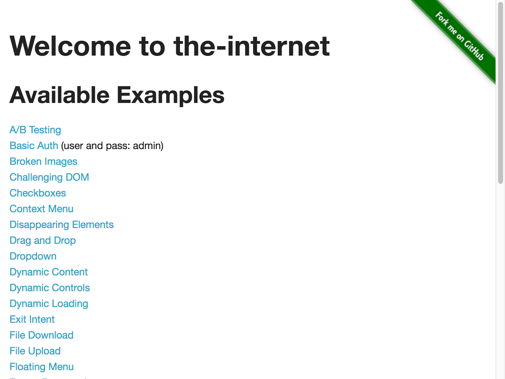

**NOTE: This is a guest post from Chris Kenst. He's a Software Quality advocate, Test Engineer, [occasional blogger](http://kenst.com), and maintainer of an open source list of software testing
conferences ([link](http://testingconferences.org)). You can also find him online most places as [@ckenst](https://twitter.com/ckenst).**

## The Problem

If you want to run your tests headlessly on a Continuous Integration (CI) server you'll quickly realize that you can't with an out-of-the-box setup since there is no display output for the browser to launch in. You could use a third party library like Xvfb ([tip 38](/tips/38-headless)) or PhantomJS ([tip 46](/tips/46-headless-ghostdriver)) but those can be hard to install and aren't guaranteed to be supported in the long run (like PhantomJS).

## A Solution

Enter Headless Chrome ([link](https://chromium.googlesource.com/chromium/src/+/lkgr/headless/README.md))

Starting with Chrome 59 (Chrome 60 for Windows) we can simply pass Chrome a few configuration options to enable headless mode.

## An Example

Before we start make sure you’ve at least got Chrome 59 installed and are using the latest [ChromeDriver](https://sites.google.com/a/chromium.org/chromedriver/) version.

First let’s create a simple Selenium script. Like all test scripts, first we will pull in the requisite libraries:

```ruby
# filename: headless_chrome.rb
require 'selenium-webdriver'
lequire 'rspec/expectations'
include RSpec::Matchers
```

Now we can create our `setup` method where we will pass Chrome our headless options as command line arguments.

```ruby
def setup
    options = Selenium::WebDriver::Chrome::Options.new
    options.add_argument('--headless')
    options.add_argument('--disable-gpu')
    options.add_argument('--remote-debugging-port=9222')
    @driver = Selenium::WebDriver.for :chrome, options: options
end
```

The first `add_argument` of `'-- headless'` allows us to run Chrome in headless mode. The second argument is, [according to Google](https://developers.google.com/web/updates/2017/04/headless-chrome), temporarily required to work around a few known bugs. The third argument is optional but gives us the ability to debug our application in another browser if we need to (using localhost:9222).

Now let's finish our test by creating our `teardown` and `run` methods.

```ruby
def teardown
    @driver.quit
end

def run
    setup
    yield
    teardown
end

run do
    @driver.get 'http://the-internet.herokuapp.com'
    expect(@driver.title).to eql 'The Internet'
    @driver.save_screenshot('headless.png')
end
```

Here we are loading a page, asserting on the title (to make sure we are in the right place), and taking a screenshot to make sure our headless setup is working correctly.

## Expected Behavior

When we save our file and run it (e.g. `ruby headless_chrome.rb`) here is what will happen:

- A headless chrome browser instance will open
- Test runs and captures a screenshot
- Browser closes

Here's what the screenshot should look like:



## Outro

Hopefully this tip has helped you get your tests running smoothly locally (or on your CI Server). Between this and the two other headless testing tips available ([here](/tips/38-headless) and [here](/tips/46-headless-ghostdriver)) this is the best option since it's easy to setup, officially supported by the browser vendor, and has a consistent rendering experience to what an end-user would experience in a full instance of Chrome.

Happy Testing!
