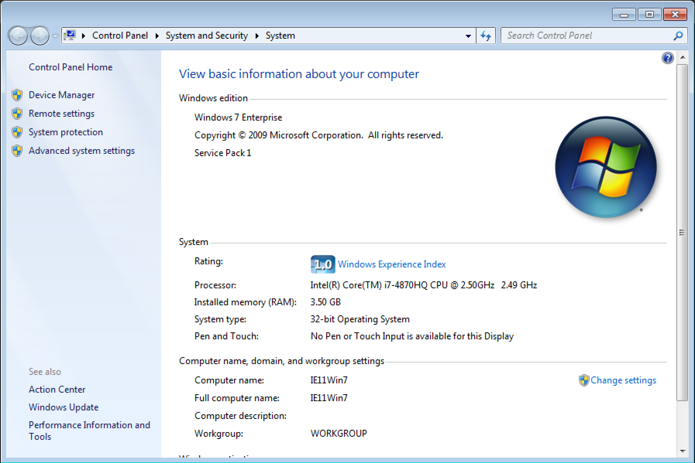
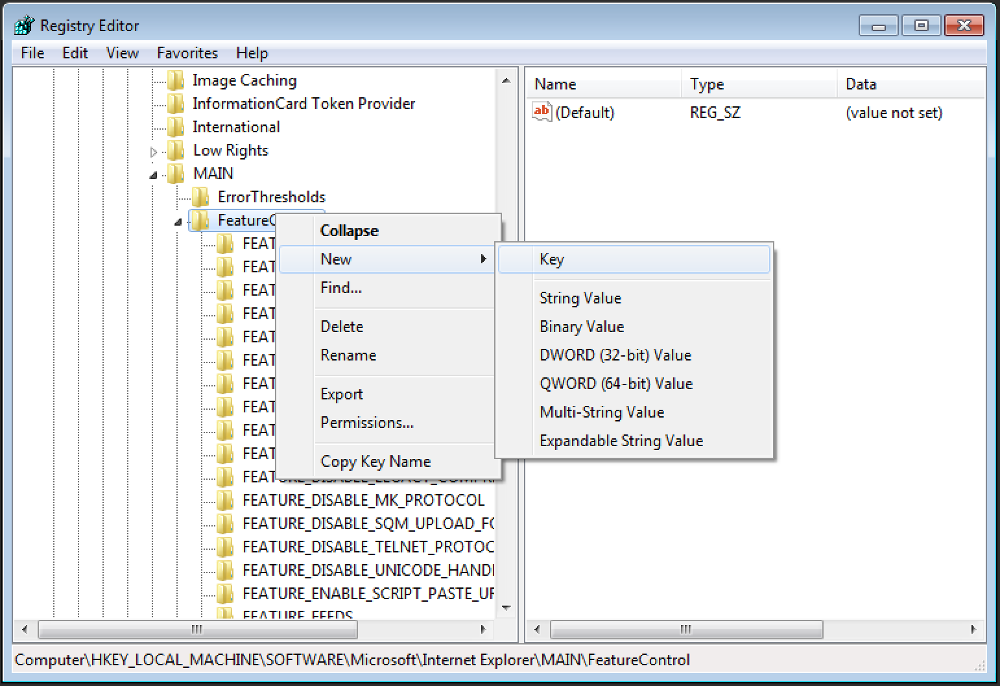
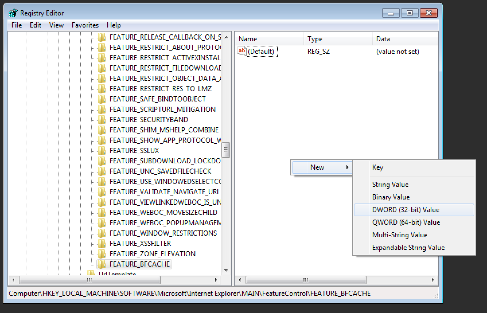

## The Problem

To get your tests running on Internet Explorer the setup is similar to Chrome. But there are a couple of extra steps you need to know in order to get things working smoothly.

## A Solution

Just like with ChromeDriver you need to download the browser driver binary and either add it to your system path or specify it in code. After that you also need to configure the privacy mode settings of Internet Explorer.

Let's step through an example.

## An Example

First we need to download [InternetExplorerDriver](https://github.com/SeleniumHQ/selenium/wiki/InternetExplorerDriver) from [here](http://selenium-release.storage.googleapis.com/index.html) and tell our Selenium tests about it. Rather than adding this to our system path, let's go ahead and add it to our test project in a `Vendor` directory.

Next we need to configure the Security Options of Internet Explorer to `Enable Protected Mode` for each zone (e.g., Internet, Local intranet, Trusted Sites, and Restricted Sites). `Internet Options` can be accessed from the `Tools` menu in Internet Explorer.


Select the Security tab and enable the checkbox for `Enable Protected Mode` for each zone and click `OK` when done.


Now to create our test class. Let's start it off by including our requisite classes for our test framework (e.g., `using NUnit.Framework`), driving the browser with Selenium (e.g., `using OpenQA.Selenium`, etc.), accessing C# methods to work with the local file system (e.g., `using System.IO`), and start our class with some setup and teardown methods.

```csharp
// filename: InternetExplorer.cs
using NUnit.Framework;
using OpenQA.Selenium;
using OpenQA.Selenium.IE;
using System.IO;

public class InternetExplorer
{
    IWebDriver Driver;
    string VendorDirectory = Directory.GetParent(
        Path.GetDirectoryName(typeof(InternetExplorer).Assembly.Location)).
            Parent.FullName + @"\Vendor";

    [SetUp]
    public void SetUp()
    {
        Driver = new InternetExplorerDriver(VendorDirectory);
    }

    [TearDown]
    public void TearDown()
    {
        Driver.Quit();
    }
```

Notice the field variable declaration for `VendorDirectory`. With it we are effectively grabbing the full path of the project directory and appending the `Vendor` directory to it. This is then put to use when creating an instance of Internet Explorer (e.g., `Driver = new InternetExplorerDriver(VendorDirectory);`).

Now it's a simple matter of writing a Hello World test method to verify that a page can be loaded by the browser.

```csharp
// filename: InternetExplorer.cs
// ...
    [Test]
    public void PageLoads()
    {
        Driver.Navigate().GoToUrl("http://the-internet.herokuapp.com");
        Assert.That(Driver.Title.Equals("The Internet"));
    }
}
```

## Running Your Tests on IE11

It's worth noting that [there is a known bug](https://github.com/seleniumhq/selenium-google-code-issue-archive/issues/6511#issuecomment-192149674) with Selenium and IE11 which prevents tests from launching a browser. Thankfully there is a workaround to this issue which involves making a tweak to your system registry.

```text
# For 32-bit Windows
HKEY_LOCAL_MACHINE\SOFTWARE\Microsoft\Internet Explorer\Main\FeatureControl\FEATURE_BFCACHE

# For 64-bit Windows
HKEY_LOCAL_MACHINE\SOFTWARE\Wow6432Node\Microsoft\Internet Explorer\Main\FeatureControl\FEATURE_BFCACHE
```

To find out if your system is 32 or 64 bit, click `Start`, right-click on `Computer`, and select `Properties`.


In the `System` section there is an entry titled `System type:`. It will tell you whether you're using a 32-bit Operating System or 64-bit.



To access your system registry click `Start`, type `regedit`, and hit `Enter`. This opens up the Registry Editor (assuming you have local administrator permissions for the machine).


The left-pane of the window enables you to traverse the registry keys in the system. Simply navigate to the correct key location depending on which version of Windows you're running (e.g., 32-bit or 64-bit). Once you've reached the `FeatureControl` sub-key you may or may not see the `FEATURE_BFCACHE` subkey. If it isn't there, add it. If it is there, skip to the next step.

To add it right-click on `FeatureControl`, click `New`, and then `Key`. Type the name `FEATURE_BFCACHE` and hit `Enter`.



Select the `FEATURE_BFCACHE` key in the left-pane and then right-click in the right-hand pane. Select `New`, then `DWORD Value`.



Type `iexplore.exe` for the name of the DWORD entry and hit `Enter`. The value for it should be `0` (which should have been set by default on creation).


Now your tests should run fine in IE11.

## Expected Behavior

When we save our test file and run the project (e.g., `nunit3-console.exe .\InternetExplorer.sln`) here is what will happen:

- The InternetExplorerDriver server launches
- A new Internet Explorer browser window opens
- Selenium visits the page
- Selenium grabs the title from the page
- An assertion is performed to check that the correct page loaded
- The browser window closes
- The InternetExpplorerDriver server quits

Depending on your User Access Control settings you might be prompted to allow the InternetExplorerDriver server to launch. Simply allow it.

## Outro

Be sure to check out [the InternetExplorerDriver documentation on the SeleniumHQ wiki](https://github.com/SeleniumHQ/selenium/wiki/InternetExplorerDriver) for more information about working with Internet Explorer and Selenium.

Happy Testing!
