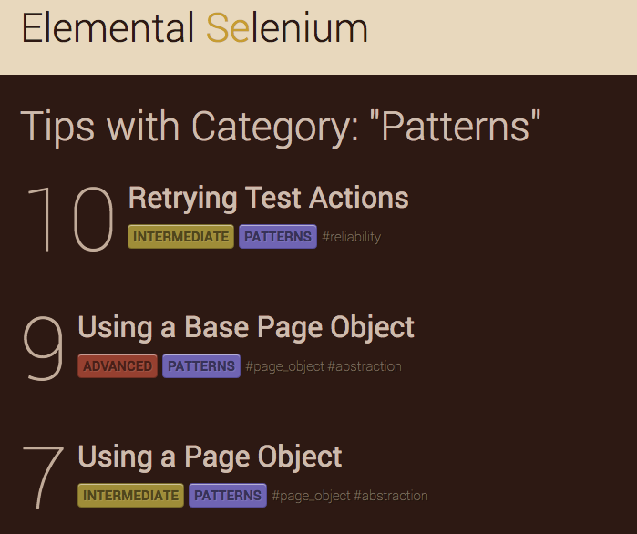
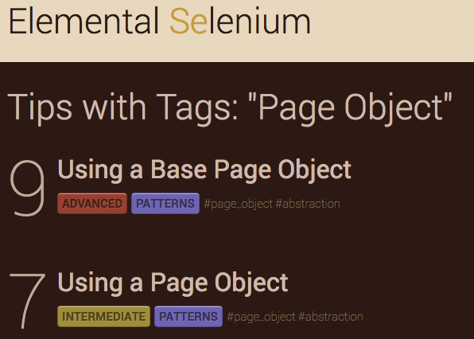

# How to Access Previous Tips

## Intro

Let me guess -- you subscribed to a free, weekly Selenium tip newsletter and aren't sure of how to access
previously written tips (or are unaware that this is even a possibility).

## A Solution

Check out [the Elemental Selenium Tip Archives](/tips)! Each tip is available there, and it's simple to traverse.

All the tips are tagged, categorized, and marked by level of difficulty. Each marking is clickable (both
within the tip and when viewing all tips on the archive page), and will return a filtered result.

## Example

If you are viewing [Tip 7](/tips/7-use-a-page-object) and click on the category (e.g. 'Patterns').

Then it will return a list of all tips with the same category.

Alternatively, you could have clicked on one of the tags (e.g. '#page_object') and it would have returned a
list of tips that were tagged similarly.

## Expected Behavior

- View the tip archive (or an individual tip)
- Click a filtering option
- See a filtered list of tips
- View and enjoy another relevant tip

## Summary

Hopefully this has helped turn you onto the bounty of freely available Selenium tips that were right at your fingertips
this whole time.

Happy Testing!

## About The Author

Dave Haeffner is the original writer of Elemental Selenium -- a free, once weekly Selenium tip newsletter that's read by
thousands of testing professionals. He also created and maintains the-internet (an open-source web app that's perfect
for writing automated tests against).

Dave has helped numerous companies successfully implement automated acceptance testing; including The Motley Fool,
ManTech International, Sittercity, and Animoto. He is also an active member of the Selenium project and has spoken at
numerous conferences and meetups around the world about automated acceptance testing.

