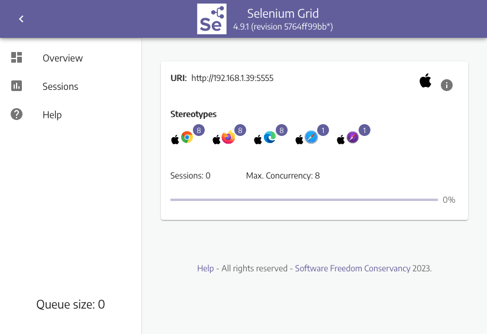

## Example

### Part 1: Grid Setup

Selenium Grid comes built into the Selenium Standalone Server. So to get started we'll need to download the latest version of it from the Selenium
[releases](https://github.com/SeleniumHQ/selenium/releases).

Then we need to start the Hub.

```sh
> java -jar selenium-server-<version>.jar hub
...
16:49:29.816 INFO [Hub.execute] - Started Selenium Hub
...
```

After that we can register Nodes to it.

```sh
> java -jar selenium-server-<version>.jar node --hub http://localhost:4444
...
16:51:47.726 INFO [NodeServer.execute] - Started Selenium Node
...
```

__NOTE: This example only demonstrates a single node on the same machine as the hub. To span nodes across multiple machines you will need to place the standalone server on each machine and launch it with the same registration command (replacing `http://localhost` with the location of your hub, and specifying additional parameters as needed).__

Now that the grid is running we can view the available browsers by visiting our Grid's console at `http://localhost:4444/grid/console`.



To refine the list of available browsers, we can specify an additional `--driver-implementation` parameter when registering the Node.
For instance, if we wanted to only offer Safari on a node, we could specify it with `--driver-implementation safari`, which would look
like this:

```sh
java -jar selenium-server-<version>.jar node --hub http://localhost:4444 --driver-implementation safari
```

We could also repeat this parameter again if we wanted to explicitly specify more than one browser.

```sh
java -jar selenium-server-<version>.jar node --hub http://localhost:4444 --driver-implementation safari --driver-implementation chrome
```

There are numerous parameters that we can use at run time. You can see a full list at the
[Selenium Grid documentation](https://www.selenium.dev/documentation/grid/configuration/cli_options/).

### Part 2: Test Setup

Now let's wire up a simple test script to use our new Grid.

First, we'll need to require our necessary libraries (e.g., `selenium-webdriver` to connect to the Grid and control the browser,
and `rspec/expectations` & `RSpec::Matchers` for an assertion), wire up some simple `setup`, `teardown`, and `run` methods,
and add a simple test.

```ruby
# filename: grid.rb

require 'selenium-webdriver'
require 'rspec/expectations'
include RSpec::Matchers

def setup
  options = Selenium::WebDriver::Options.chrome
  @driver = Selenium::WebDriver.for :remote, url: 'http://localhost:4444', options: options
end

def teardown
  @driver.quit
end

def run
  setup
  yield
  teardown
end

run do
  @driver.get 'http://the-internet.herokuapp.com'
  expect(@driver.title).to eq('The Internet')
end
```

Notice in this configuration we're using a remote WebDriver in Selenium (e.g., `Selenium::WebDriver.for :remote,`) to connect to the Grid.
And we are telling the Grid which browser we want to use with the browser options (e.g., `options = Selenium::WebDriver::Options.chrome`).

You can see a full list of the available browser options at the [Selenium documentation](https://www.selenium.dev/documentation/webdriver/browsers/).

## Expected Behavior

When we save this file and run it (e.g., `ruby grid.rb` from the command-line) here is what will happen:

+ Connect to the Grid Hub
+ Hub determines which Node has the necessary browser/platform combination
+ Hub connects the test to the Node
+ Browser opens on the Node
+ Test runs
+ Browser closes on the Node

## Summary

If you're looking to set up Selenium Grid to work with Internet Explorer or Chrome, be sure to read up on how to set them up since there is
additional configuration required for each. And if you run into issues, be sure to check out the browser driver documentation for the
browser you're working with:

+ [ChromeDriver](https://chromedriver.chromium.org/)
+ [FirefoxDriver](https://firefox-source-docs.mozilla.org/testing/geckodriver/Support.html)
+ [SafariDriver](https://developer.apple.com/documentation/webkit/about_webdriver_for_safari)

Also, it's worth noting that while Selenium Grid is a great option for scaling your test infrastructure, it by itself will NOT give you
parallelization. That is to say, it can handle as many connections as you throw at it (within reason), but you will still need to find a
way to execute your tests in parallel.

Happy Testing!
